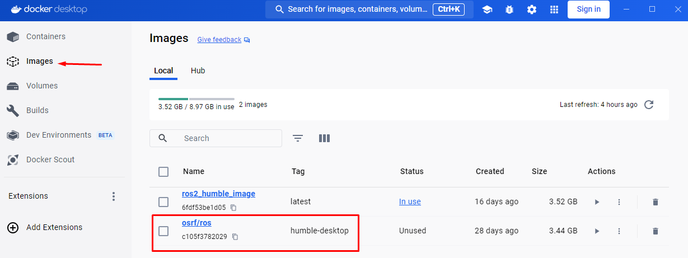
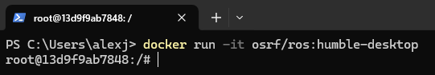
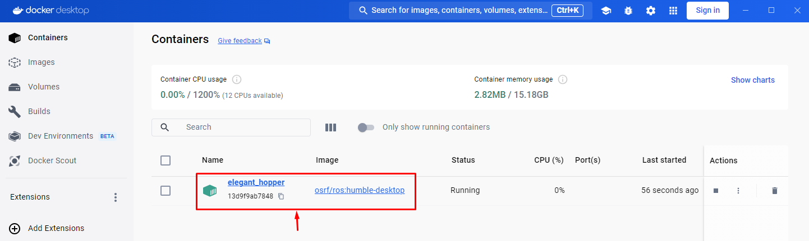
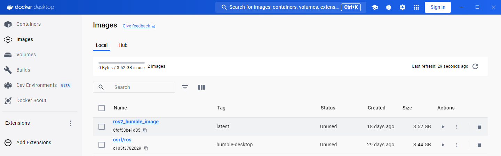
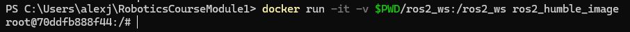
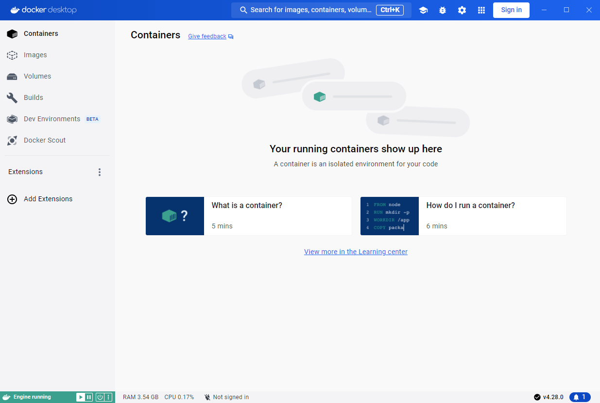

Installation and software setup
=====

.. _installation:

Installation
-----------------

There are plenty of ways to use ROS 2, among the most common ones, there are:

- Working with a VM with Linux OS and install ROS 2 on it.
- Have Linux host machine or a dual-boot PC and install ROS 2 on it.
- Work completely online with no installation requirements (https://www.theconstruct.ai/).
- Using a docker container on a Windows host machine. 

The last option is the one preferred for this course. Hence, all the content of this course will be based on a Windows host machine with a Docker installation providing a ROS 2 container; specifically the Humble ROS 2 distribution is utilized.

Docker installation and configuration
~~~~~~~~~~

Start by downloading Docker installer from this link: https://docs.docker.com/desktop/install/windows-install/. In the same link, it is posted the system requirements, be aware that ``wsl2 of Hyper-V`` is required to fully work with Docker. Hence, at some point it will be required to install ``wsl2`` tool if not already installed.

Execute the ``Docker Desktop for Windows`` installer that was downladed. Follow the instructions on the installation wizard clicking ``Next`` at each installation step.

Restart the PC for the changes to take effect.

Run the Docker program from Windows. For the first time execution, it will ask to sing in and to complete a survey. Skip both for the moment. 

Xlaunch installation
~~~~~~~~~~

Next download Xlaunch program from: https://sourceforge.net/projects/vcxsrv/. This program enables the user to work with graphical windowing system used in Unix-like operating systems. 

Recall that from Docker, a Linux container will be executed. And from there, only a terminal window will be the interface to work with that OS. If some GUI applications are needed, these will be provided by the Xlaunch program.

Execute the Xlaunch installer following the installation wizard and clicking ``Next`` at each installation step.

Search for ROS images
~~~~~~~~~~

Go to https://hub.docker.com/u/osrf which is a docker repository containing ROS images of various distributions.

For this course, the image that is going to be used is ``ros:humble-desktop``, which is found here: https://hub.docker.com/r/osrf/ros/tags. Open a Windows terminal and execute:

.. code-block:: console

   docker pull osrf/ros:humble-desktop

This command pulls a docker image from the specified Docker registry. 

Once the docker image is pulled, it must be shown under the ``Images`` section of the Docker desktop application along with any other docker image that was pulled or generated before. 

Generate proper Docker image
~~~~~~~~~~

In order to use the recently pulled Docker image, execute:

.. code-block:: console

   docker run -it osrf/ros:humble-desktop

-	The ``-it`` command refers to "interactive" and "TTY". Which basically makes the Docker container run in interactive mode, allowing to enter commands directly into the container's terminal and see their output.
-	``osrf/ros:humble-desktop`` is the Docker image name. ``osrf/ros`` is the repository or the name of the Docker image, while ``humble-desktop`` is the tag assigned to that particular version or configuration of the Docker image.

Something similar should be the result of this command execution.

And in the Docker desktop application, in the containers section, see that a container was generated with a random name.

Now, in the docker container's terminal inspect the Ubuntu version. Execute:

.. code-block:: console

   lsb_release -a

This should be the output:

.. code-block:: console

   No LSB modules are available.
   Distributor ID: Ubuntu
   Description:    Ubuntu 22.04.4 LTS
   Release:        22.04
   Codename:       jammy

Next, see the ROS 2 distribution installed in this docker image. Execute:

.. code-block:: console

   printenv ROS_DISTRO

This should be the result in the terminal:

.. code-block:: console

   humble

At this point, it is verified that the Docker image has already installed ROS 2 on it; this is the purpose of a Docker image, to gather all software needed, and be ready to be executed and worked on it. Press ``Ctrl+d`` to exit the Docker container.

For this course, some additional settings are to be performed on this image. To achieve this, in the Windows terminal that is already opened, navigate to the desired directory and create a file called ``Dockerfile``. Copy this content into the created file.

.. code-block:: console

   FROM osrf/ros:humble-desktop

   RUN apt-get update && apt-get install -y nano && apt-get install tree 
   RUN apt install -y python3-pip
   RUN apt-get install dos2unix
   RUN pip3 install setuptools==58.2.0
   RUN echo "source /opt/ros/humble/setup.bash" >> ~/.bashrc

Basically, what it is performed with the ``Dockerfile`` script above, is to build a new Docker image. For more information of the content of this script, go to `"Configuring environment"`_ section.

.. _"Configuring environment": https://alex-readthedocs-test.readthedocs.io/en/latest/Configuring%20environment.html#the-dockerfile-script-explained

Go to the Windows terminal and execute the following to build a new Docker image. 

.. code-block:: console

   docker image build -t ros2_humble_image .

The ``-t`` flag stands for "tag" and assigns a human-readable name to the new image, ``ros2_humble_image`` in this case. 
Finally, the ``.`` character, indicates Docker to look for a Dockerfile in the current directory (.), which contains the instructions for building the image.

Go to the Docker desktop application and see the new Docker image.

Now, this is the Docker image that is going to be used for the course. From this Docker image, a Docker container must be initialized when working on this course. 

Code setup for working with Docker
--------------------------

When using a Docker container, any modifications made during a session aren't automatically preserved within the container once the session ends; unless, of course, a new session is created pointing to the exact same container. 

To retain progress made among sessions, Docker provides the concept of volumes within its environment. These volumes enable the persistence of changes, ensuring that they're maintained across different sessions.

Hence, the recommended way to work in this course is to create, in the preferred directory within the Windows machine, a folder that will contain all the code for the different sections of this course. Next, execute the following command to initiate a Docker container and mount a volume to it:

.. code-block:: console

   docker run -it -v $PWD/ros2_ws:/ros2_ws ros2_humble_image

``-v $PWD/ros2_ws:/ros2_ws``: This part specifies a volume (``-v``) to be mounted inside the container. It binds the directory ``$PWD/ros2_ws`` on the local Windows machine to the directory ``/ros2_ws`` within the container. This allows for data sharing between the host machine and the container.  In the example provided, ``ros2_ws`` refers to the folder on the Windows local machine containing all the course code progress. It also serves as the ROS 2 workspace for this course; Further details about this workspace will be covered in the `next section`_.

.. _next section: https://alex-readthedocs-test.readthedocs.io/en/latest/Configuring%20environment.html#creating-and-configuring-the-workspace

In this way any change that is performed in ``$PWD/ros2_ws`` will be saved in the local Windows machine and the progress can be saved from one Docker session to another.

Version control with Github
~~~~~~~~~~

Optionally, the ``ros2_ws`` folder can be linked to a github repository. Follow these steps to have version control on this folder:

- Open a new Windows terminal. 

- Navigate to the ``ros2_ws`` directory and create inside of it, a file called ``HelloWorld.txt``. This dummy file is created inside this folder because pushing an empty folder typically causes errors.

- Go to the internet browser and enter https://github.com. Create an account if not having one yet, and create a new github repository at https://github.com/new. When entering the repository creation link, provide a name to it, select it to be a public repository and click on "Create repository" button. It is recommended that the repository has the same name as the folder that will contain the course code, in this case, the recommended repository name would be ``ros2_ws``.

- Make sure ``git`` is installed on the Windows machine. Open a Windows terminal and execute:

.. code-block:: console

   git version

If it's an unknown command, install git following this guide: https://github.com/git-guides/install-git.

- Navigate to the folder that contains the course code (``<path_to_ws_folder>/ros2_ws`` in this particular case) and execute: 

.. code-block:: console

   git init

This will create a hidden folder named ``.git``. 

- Next, execute:

.. code-block:: console

   git add .

   git commit -m "Initial commit: Add source code files"

   git remote add origin <repository-url>

Where ``<repository-url>`` is the url of the new repository that was previously created with a Github account. 

- Finally, execute:

.. code-block:: console

   git push -u origin master

At this point, the ``ros2_ws`` folder that exists locally in the Windows machine now also resides in Github, in the publicly available online repository that was created; check in the browser the contents of the created repository, should be the same as the local folder.

Additionally, any change that is made in the local folder can be pushed to the online repository using the appropriate git commands (``git add .``,  ``git commit`` and ``git push``). 

Running a Docker container
--------------------------

In order to use GUI applications from within the container that will be created, first, if not perfomed yet, run the Xlaunch application and set the ``Display`` number to zero. 

.. image:: images/XlaunchSetDisplayToZero.png
   :alt: Setting display number to zero in Xlaunch.

Make sure that in the Docker desktop GUI window, there are no containers running.

Open a terminal in Windows, navigate to the directory where the folder containing the code progress is stored, and execute the Docker command to start running a container based on a specified docker image. This is the structure of such Docker command:

.. code-block:: console

   docker run --name <container_name> -e DISPLAY=host.docker.internal:0.0 -v $pwd/<workspace_name>/:/<workspace_name> -it <image_name>

- ``--name`` argument is used to specify a custom name for the container that will be created. Hence, it is accompanied by ``<container_name>``.
- ``-e`` argument sets an environment variable within the container. In this case, it's setting the ``DISPLAY`` environment variable to ``host.docker.internal:0.0``. This is commonly used when it is desired to display GUI applications from within a Docker container.
- ``-v`` argument mounts a volume inside the container. It allows mapping a directory on the host system (Windows OS system) to a directory inside the container. In this case, ``$pwd/<workspace_name>`` represents the current working directory followed by a directory named ``<workspace_name>`` on the host system, and ``/<workspace_name>`` represents the same directory inside the container.
- ``-it`` argument combines two flags, ``-i`` and ``-t``, which respectively stand for interactive mode and allocate a pseudo-TTY. This allows interacting with the container's command-line interface.

An example of this docker command execution:

.. code-block:: console

   docker run --name ros2_container -e DISPLAY=host.docker.internal:0.0 -v $pwd/ros2_ws/:/ros2_ws -it ros2_humble_image

.. image:: images/RunningDockerContainer.png
   :alt: Running a docker container.

Opening a new terminal for the Docker container
----------------------

When opening a new terminal in Windows, it will be necessary to link that terminal with the already running Docker container. See the command structure to achieve this:

.. code-block:: console
   
   docker exec -it <name_of_the_container> bash

See the example below:

.. code-block:: console
   
   docker exec -it ros2_container bash

.. image:: images/OpenNewTerminalLinkToContainer.png
   :alt: Linking a new terminal to the docker container.

See that ``ros2_container`` is the name of the docker container that the current terminal is to be linked with.

Afterwards, if working with custom packages, i.e packages that were created during the course or imported from a third party repository, it will be necessary to source the appropriate setup file. Navigate to the workspace directory and execute:

.. code-block:: console
   
   source install/setup.bash

See the example below:

.. image:: images/onlySourcingWorkspace.png
   :alt: Sourcing the workspace only.

For further information on this, check `this section of the course`_.

.. _this section of the course: https://alex-readthedocs-test.readthedocs.io/en/latest/Configuring%20environment.html#workspace-sourcing

